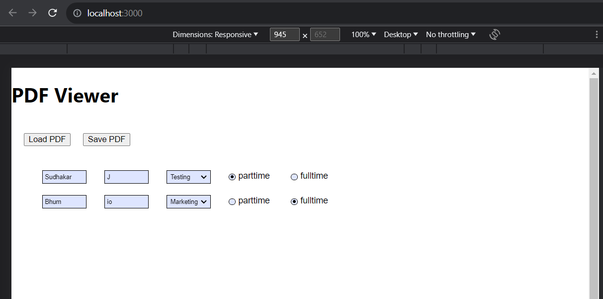
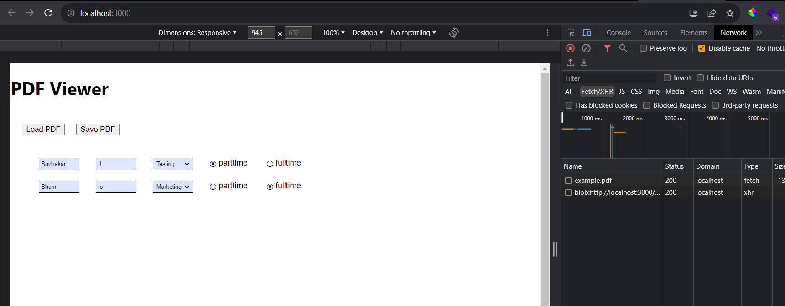
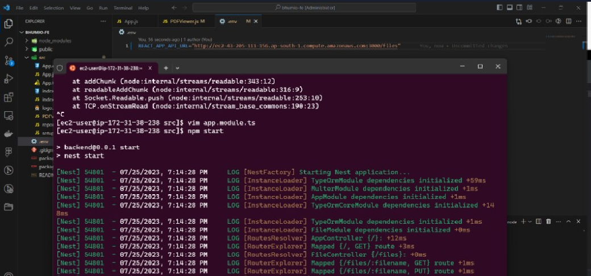
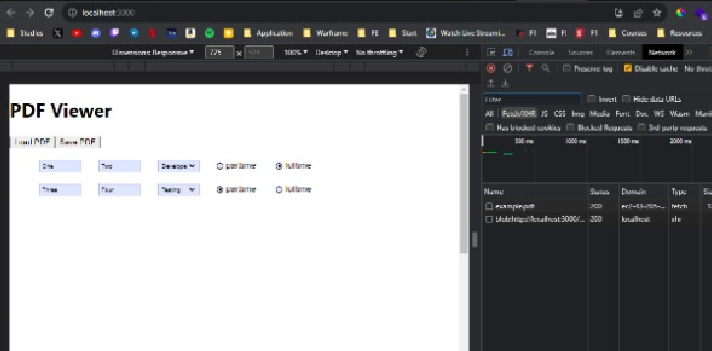

# Steps to replicate the project(Bhum-Frontend)

- git clone `https://github.com/Sudhakar7J/Bhum-fend`.
- `npm install` to install the necessary node_modules to your working directory.
- setup .env file in the root directory with the listening port of NestJS Backend (http://localhost:4000/files) Refer `https://github.com/Sudhakar7J/Bhum-be` for NestJS implementation for Backend.

## **Launch the backend implementation**

- Run Backend NestJS using `npm run start:dev` and wait till the server starts running.

## **Launch the frontend implementation**

- Run Frontend React app using `npm start` and it will launch the dev server at `http://localhost:3000/`
- Open [http://localhost:3000](http://localhost:3000) to view it in your browser.

## Working Snippets

- When Load PDF is clicked, the example.pdf stored in the NestJS Backend is fetched.
  

- Changes can be made to the example.pdf file that is loaded to the client react-app and when Save PDF is clicked, the modified PDF is saved and sent back to the server.

- When Load PDF is clicked again, the modfied PDF that was sent back to the server, is fetched again when loading and changes can be done again and saved.

# Better Implementation Practice

- Better practices to do this is to host it in a Web service.
- I tried implementing the NestJS backend in Amazon AWS EC2, with Postgres as Amazon RDS Database and ran the hosted server.

  
  

  - the example.pdf file is being fetched from the hosted EC2 instance.
  - Due to unforseen circumstances of my Amazon AWS Free tier, getting exhausted, I am not able to provide you with the hosted website on the go.
  -
